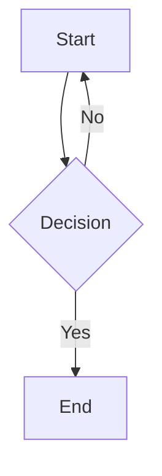

# MarkView.Avalonia

[](https://www.nuget.org/packages/MarkView.Avalonia)
[](https://www.nuget.org/packages/MarkView.Avalonia)
[](https://avaloniaui.net)
[](LICENSE.md)
[](https://github.com/Kryptos-FR/MarkView.Avalonia/actions/workflows/ci.yml)

A [Markdig](https://github.com/xoofx/markdig)-powered markdown viewer control for [Avalonia UI](https://avaloniaui.net) v12. Drop `MarkdownViewer` into any Avalonia window or panel to render rich markdown — headings, code blocks, tables, task lists, links, images, and more — using native Avalonia controls with a fully customizable theme.

## Installation

```bash
dotnet add package MarkView.Avalonia
```

## Quick Start

Include the default theme and add `MarkdownViewer` to your XAML:

```xml
<Window xmlns="https://github.com/avaloniaui"
        xmlns:x="http://schemas.microsoft.com/winfx/2006/xaml"
        xmlns:mv="using:MarkView.Avalonia">
  <Window.Styles>
    <StyleInclude Source="avares://MarkView.Avalonia/Themes/MarkdownTheme.axaml" />
  </Window.Styles>

  <mv:MarkdownViewer Markdown="# Hello, MarkView!" />
</Window>
```

### Setting a base URI for relative links and images

```csharp
viewer.BaseUri = new Uri("https://raw.githubusercontent.com/Kryptos-FR/MarkView.Avalonia/main/");
viewer.Markdown = markdownText; // relative image paths resolved against BaseUri
```

### Handling link clicks

```csharp
viewer.LinkClicked += (_, e) =>
{
    // e.Url contains the clicked URL
    Process.Start(new ProcessStartInfo(e.Url) { UseShellExecute = true });
};
```

`LinkClickedEvent` is an Avalonia **routed event** (bubbles up) — subscribe globally once at app startup to handle all viewers:

```csharp
// App.axaml.cs — applies to every MarkdownViewer in the application
MarkdownViewer.LinkClickedEvent.AddClassHandler<MarkdownViewer>((_, e) =>
    Process.Start(new ProcessStartInfo(e.Url) { UseShellExecute = true }));
```

### Navigating to an anchor

```csharp
viewer.ScrollToAnchor("my-heading");  // scrolls to the heading's anchor position
```

### Using a custom Markdig pipeline

```csharp
viewer.Pipeline = new MarkdownPipelineBuilder()
    .UseSupportedExtensions()
    .UseAlertBlocks()
    .UseFootnotes()
    .Build();
```

## Extension Methods

Convenience methods configure a pipeline with a single opt-in feature:

```csharp
viewer.UseFootnotes();
viewer.UseAlertBlocks();
viewer.UseAbbreviations();
viewer.UseFigures();
viewer.UseMediaLinks();
```

To combine several opt-in features, build the pipeline explicitly (see above).

## Application-Wide Defaults

`MarkdownViewerDefaults` lets you set a pipeline and/or extensions once so that every `MarkdownViewer` in the application inherits them automatically — no need to configure each instance:

```csharp
// App.axaml.cs
MarkdownViewerDefaults.Pipeline = new MarkdownPipelineBuilder()
    .UseSupportedExtensions()
    .UseFootnotes()
    .UseAlertBlocks()
    .Build();

MarkdownViewerDefaults.Extensions.AddTextMateHighlighting();
MarkdownViewerDefaults.Extensions.AddSvg();
MarkdownViewerDefaults.Extensions.AddMermaid();
```

Per-instance `Pipeline` and `Extensions` take precedence over the defaults; an extension object shared between the defaults list and an instance list is only registered once per render.

## Supported Markdown Features

### CommonMark baseline (always on)

| Feature | Notes |
|---------|-------|
| Headings H1–H6 | CommonMark |
| Bold, italic | CommonMark |
| Inline code | CommonMark |
| Fenced code blocks | CommonMark |
| Blockquotes | CommonMark |
| Ordered and unordered lists | CommonMark, tight and loose |
| Links and autolinks | CommonMark + extension |
| Images | CommonMark, remote URLs loaded async |
| Thematic breaks | CommonMark |
| Hard line breaks | CommonMark (`\` or two spaces) |
| HTML `<br>` / `<br />` | Rendered as line break |

### Extensions (enabled by `UseSupportedExtensions()`)

| Feature | Syntax |
|---------|--------|
| Strikethrough | `~~text~~` |
| Subscript | `~text~` |
| Superscript | `^text^` |
| Underline (inserted) | `++text++` |
| Highlight (marked) | `==text==` |
| Task lists | `- [x] item` |
| Pipe tables | GFM-style `\| col \| col \|` |
| Grid tables | RST-style grid tables |
| Autolinks | bare `https://…` URLs |

### Opt-in extensions

These require adding `.UseXxx()` to the pipeline (see [Extension Methods](#extension-methods) below):

| Feature | Activation | Syntax |
|---------|-----------|--------|
| Footnotes | `UseFootnotes()` | `[^1]` / `[^1]: …` |
| GitHub alert blocks | `UseAlertBlocks()` | `> [!NOTE]` etc. |
| Abbreviations | `UseAbbreviations()` | `*[HTML]: …` |
| Figures | `UseFigures()` | `^^^` / `^^^ caption` |
| YouTube embeds | `UseMediaLinks()` | `` |

## Extension Packages

MarkView.Avalonia ships optional NuGet packages that add richer rendering capabilities. Each package implements `IMarkViewExtension` and is activated via a convenience method on `MarkdownViewer`, or globally via `MarkdownViewerDefaults.Extensions.AddXxx()`.

### Syntax Highlighting (`MarkView.Avalonia.SyntaxHighlighting`)

Adds TextMate grammar-based syntax highlighting to fenced code blocks.

```bash
dotnet add package MarkView.Avalonia.SyntaxHighlighting
```

```csharp
viewer.UseTextMateHighlighting(); // DarkPlus / LightPlus by default
// or with custom themes:
viewer.UseTextMateHighlighting(darkTheme: ThemeName.Monokai, lightTheme: ThemeName.QuietLight);
```

The extension replaces the built-in `CodeBlockRenderer` with `TextMateCodeBlockRenderer`, which tokenises each line and emits coloured `Run` elements. Unsupported languages fall back to the default monochrome rendering automatically.

Colours update in-place when the user switches between light and dark themes — no document rebuild or scroll reset.

Available `ThemeName` values are defined by TextMateSharp.Grammars: `DarkPlus`, `LightPlus`, `Monokai`, `SolarizedDark`, `SolarizedLight`, and more.

### SVG Images (`MarkView.Avalonia.Svg`)

Renders SVG images embedded in markdown (``), including `data:image/svg+xml` data URIs and badge-service URLs that return SVG without a `.svg` extension.

```bash
dotnet add package MarkView.Avalonia.Svg
```

```csharp
viewer.UseSvg();
```

The extension inserts `SvgImageLoader` at the front of the image loader chain. Regular raster images continue to load via the built-in HTTP fallback.

### Mermaid Diagrams (`MarkView.Avalonia.Mermaid`)

Renders fenced `mermaid` code blocks as SVG diagrams using the [Mermaider](https://github.com/nullean/mermaider) library (pure .NET, no browser required). Works on all platforms including Linux. Diagrams re-render automatically when the user switches between light and dark themes.

```bash
dotnet add package MarkView.Avalonia.Mermaid
```

```csharp
viewer.UseMermaid();
```

Markdown syntax:

````markdown

````

### Combining extensions

All three can be stacked:

```csharp
viewer
    .UseTextMateHighlighting()
    .UseSvg()
    .UseMermaid();
```

Extensions are applied in the order they are added to `viewer.Extensions`. Each extension's `Register` method is called once per render pass, before the Markdig pipeline is set up.

### Writing your own extension

Implement `IMarkViewExtension` from the core package:

```csharp
using MarkView.Avalonia.Extensions;
using MarkView.Avalonia.Rendering;

public class MyExtension : IMarkViewExtension
{
    public void Register(AvaloniaRenderer renderer)
    {
        // swap a renderer, add an image loader, or set a code highlighter
        renderer.ObjectRenderers.ReplaceOrAdd<CodeBlockRenderer>(new MyCodeBlockRenderer());
    }
}

viewer.Extensions.Add(new MyExtension());
```

## Theming / Customization

Include `MarkdownTheme.axaml` for default styles. Override any style class in your own `Styles` to customise appearance:

| Style class | Applied to | Controls |
|-------------|------------|----------|
| `markdown-h1` … `markdown-h6` | Headings | `TextBlock` |
| `markdown-paragraph` | Paragraphs | `TextBlock` |
| `markdown-code-block` | Code blocks | `Border` |
| `markdown-code-inline` | Inline code | `Border` |
| `markdown-blockquote` | Blockquotes | `Border` |
| `markdown-list` | Lists | `StackPanel` |
| `markdown-thematic-break` | Horizontal rules | `Separator` |
| `markdown-image` | Images | `Image` |
| `markdown-link` | Hyperlinks | `HyperlinkButton` |
| `markdown-table` | Tables | `Grid` |
| `markdown-table-cell` | Table cells | `Border` |
| `markdown-table-header` | Header cells | `Border` |
| `markdown-marked` | Highlighted text (`==…==`) | `Span` |
| `markdown-alert` | Alert block container | `Border` |
| `markdown-alert-note` … `markdown-alert-caution` | Per-kind border colour | `Border` |
| `markdown-alert-header` | Alert kind label | `TextBlock` |
| `markdown-figure` | Figure container | `Border` |
| `markdown-figure-caption` | Figure caption | `TextBlock` |
| `markdown-abbr` | Abbreviation with tooltip | `TextBlock` |
| `markdown-footnote-ref` | Footnote reference link | `HyperlinkButton` |
| `markdown-footnote-group` | Footnote definition list | `StackPanel` |
| `markdown-footnote-item` | Individual footnote row | `Grid` |

Example — increase heading size and add a bottom border:

```xml
<Style Selector="TextBlock.markdown-h1">
  <Setter Property="FontSize" Value="36" />
  <Setter Property="Foreground" Value="#1A1A2E" />
  <Setter Property="Margin" Value="0,12,0,6" />
</Style>
```

## Text Selection

`MarkdownViewer` supports full document-wide text selection:

- **Click + drag** to select a range.
- **`Ctrl+A`** to select all text.
- **`Ctrl+C`** to copy the selection to the clipboard.

Programmatic API:

```csharp
viewer.SelectAll();
viewer.ClearSelection();
string text = viewer.GetSelectedText();
await viewer.CopyToClipboardAsync();
```

Images and task-list checkboxes are skipped during selection (same behaviour as all reference libraries).

## Known Limitations

| Limitation | Detail |
|---|---|
| Images are non-selectable | Images in inline position are embedded as `InlineUIContainer` — selection skips around them. This is the same behaviour as all reference libraries. |
| Task checkboxes are non-selectable | Same reason as images. |
| Anchor scroll is instant | `BringIntoView()` jumps without animation. Smooth scrolling is a future improvement. |

## License

[MIT](LICENSE.md) © Nicolas Musset
