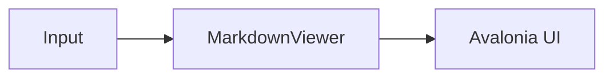

# Extension Packages

## SyntaxHighlighting

**Package:** `MarkView.Avalonia.SyntaxHighlighting`  
**[README](../src/MarkView.Avalonia.SyntaxHighlighting/README.md)**

Replaces the built-in `CodeBlockRenderer` with `TextMateCodeBlockRenderer`, which tokenises each line via TextMate grammars and emits coloured `Run` elements.

### Activation

```csharp
// DarkPlus / LightPlus defaults
viewer.UseTextMateHighlighting();

// Explicit themes
viewer.UseTextMateHighlighting(
    darkTheme:  ThemeName.Monokai,
    lightTheme: ThemeName.QuietLight);
```

Or globally:

```csharp
MarkdownViewerDefaults.Extensions.AddTextMateHighlighting();
MarkdownViewerDefaults.Extensions.AddTextMateHighlighting(ThemeName.Monokai, ThemeName.QuietLight);
```

### Theme switching

When the Avalonia theme variant changes (light ↔ dark), `TextMateCodeBlockRenderer` rebuilds only the `TextBlock.Inlines` for each code block. The document structure, scroll position, and all other content are untouched.

### Fallback

Languages not in the grammar registry fall back to monochrome rendering automatically.

---

## Svg

**Package:** `MarkView.Avalonia.Svg`  
**[README](../src/MarkView.Avalonia.Svg/README.md)**

Renders SVG images using [Svg.Skia](https://github.com/wieslawsoltes/Svg.Skia), the same vector backend Avalonia uses internally.

### Activation

```csharp
viewer.UseSvg();
// or globally:
MarkdownViewerDefaults.Extensions.AddSvg();
```

### Supported URL formats

| URL form | Notes |
|----------|-------|
| `https://example.com/icon.svg` | HTTP download |
| Any `https://` URL | Attempted speculatively; falls back to bitmap if not SVG |
| `data:image/svg+xml;base64,…` | Base64-decoded SVG |
| `data:image/svg+xml,…` | URL-decoded SVG |

Badge services (e.g. `shields.io`) that return SVG without a `.svg` extension are handled automatically via the speculative HTTP rule.

---

## Mermaid

**Package:** `MarkView.Avalonia.Mermaid`  
**[README](../src/MarkView.Avalonia.Mermaid/README.md)**

Renders fenced `mermaid` code blocks as SVG diagrams using [Mermaider](https://github.com/nullean/mermaider) — a pure .NET implementation with no browser, WebView, or JavaScript runtime.

### Activation

```csharp
viewer.UseMermaid();
// or globally:
MarkdownViewerDefaults.Extensions.AddMermaid();
```

### Markdown syntax

````markdown

````

### Supported diagram types

Flowcharts, sequence diagrams, class diagrams, state diagrams, ER diagrams, Gantt charts, pie charts, git graphs, mind maps, timelines, and more — whatever Mermaider supports.

### Theme awareness

Diagrams are automatically re-rendered when the user switches between light and dark themes. The `Border` container stays in place so the scroll position is preserved.

| Variant | Background | Foreground | Accent |
|---------|-----------|-----------|--------|
| Dark | `#18181B` | `#FAFAFA` | `#60a5fa` |
| Light | `#FFFFFF` | `#27272A` | `#3b82f6` |

### Fallback

If rendering fails, the extension falls back to a plain-text block containing the original Mermaid source.

---

## Using all three together

```csharp
MarkdownViewerDefaults.Extensions.AddTextMateHighlighting();
MarkdownViewerDefaults.Extensions.AddSvg();
MarkdownViewerDefaults.Extensions.AddMermaid();
```

`MermaidBlockRenderer` is inserted at index 0 of `renderer.ObjectRenderers` and intercepts every `FencedCodeBlock`. Mermaid blocks are rendered as diagrams; all other fenced blocks pass through to `TextMateCodeBlockRenderer` (or the default `CodeBlockRenderer` if the SyntaxHighlighting extension is not active).
