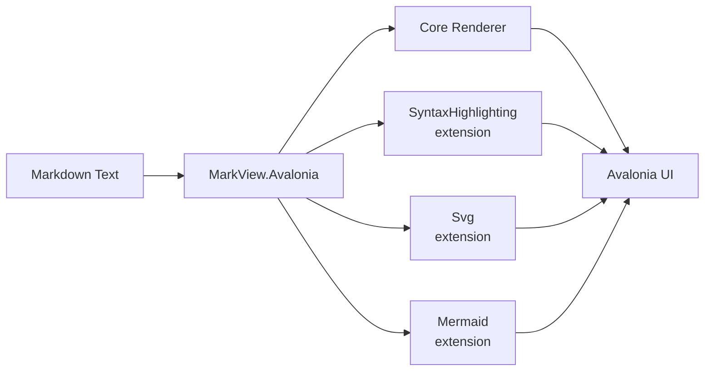

# MarkView.Avalonia Feature Showcase

> Welcome to the **MarkView.Avalonia** feature showcase. This document demonstrates every
> rendering capability supported by the viewer and its extension packages.

## Table of Contents

- [Headings](#headings)
- [Text Formatting](#text-formatting)
- [Emphasis Extras](#emphasis-extras)
- [Blockquotes](#blockquotes)
- [Task List](#task-list)
- [Tables](#tables)
- [Code Blocks](#code-blocks)
- [Bitmap Image](#bitmap-image)
- [SVG Image](#svg-image)
- [Mermaid Diagram](#mermaid-diagram)
- [Math](#math)

---

## Headings

# Heading 1
## Heading 2
### Heading 3
#### Heading 4
##### Heading 5
###### Heading 6

---

## Text Formatting

Regular paragraph with **bold text**, *italic text*, ~~strikethrough~~, and `inline code`.

You can also combine them: ***bold and italic***, **`bold code`**, *~~italic strikethrough~~*.

---

## Emphasis Extras

The `EmphasisExtras` Markdig extension unlocks four additional inline styles:

| Syntax | Result | Description |
|--------|--------|-----------|
| `~text~` | H~2~O | Subscript |
| `^text^` | x^2^ + y^2^ = r^2^ | Superscript |
| `++text++` | ++inserted++ | Underline (inserted) |
| `==text==` | ==marked== | Highlighted (marked) |

---

## Blockquotes

> This is a top-level blockquote. It can contain *formatted* text and **multiple** lines.
>
> > This is a nested blockquote inside the first one.
> > Nested content can also span multiple lines.
>
> Back to the outer blockquote.

---

## Task List

- [x] Core markdown rendering (headings, paragraphs, lists)
- [x] Syntax-highlighted code blocks via `MarkView.Avalonia.SyntaxHighlighting`
- [x] SVG image rendering via `MarkView.Avalonia.Svg`
- [x] Mermaid diagram rendering via `MarkView.Avalonia.Mermaid`
- [x] LaTeX math rendering via `MarkView.Avalonia.Math`
- [x] Tables, blockquotes, task lists
- [ ] PDF export (planned)

---

## Tables

| Extension Package | Feature | NuGet Status | Notes |
|---|---|---|---|
| `MarkView.Avalonia` | Core rendering | ✅ Published | Markdig-based |
| `MarkView.Avalonia.SyntaxHighlighting` | Code highlighting | ✅ Published | TextMate grammars |
| `MarkView.Avalonia.Svg` | SVG images | ✅ Published | Avalonia.Svg |
| `MarkView.Avalonia.Mermaid` | Mermaid diagrams | ✅ Published | Pure .NET |
| `MarkView.Avalonia.Math` | LaTeX math | ⚠️ Prerelease dependency | CSharpMath.Avalonia |

---

## Code Blocks

### C#

```csharp
using MarkView.Avalonia;

var viewer = new MarkdownViewer();
viewer.UseTextMateHighlighting()
      .UseSvg()
      .UseMermaid();

viewer.Markdown = "# Hello, **World**!";
```

### JSON

```json
{
  "name": "MarkView.Avalonia",
  "version": "1.0.0",
  "extensions": [
    "SyntaxHighlighting",
    "Svg",
    "Mermaid"
  ],
  "targetFramework": "net8.0"
}
```

### Python

```python
import base64

svg = '<svg xmlns="http://www.w3.org/2000/svg" width="200" height="120"></svg>'
encoded = base64.b64encode(svg.encode()).decode()
data_uri = f"data:image/svg+xml;base64,{encoded}"
print(data_uri)
```

---

## Bitmap Image

The images below use relative paths — they resolve against the `BaseUri` that MarkView infers automatically from the `Source` location (here, `avares://MarkView.Avalonia.Demo/Assets/`).

Two equivalent syntaxes are supported for specifying image dimensions:

| Form | Syntax | Notes |
|------|--------|-------|
| Quoted title | `` | Valid CommonMark — portable across renderers (others show the title as a tooltip) |
| Shorthand | `` | MarkView-only convenience; preprocessed to the quoted form before parsing |

The table below shows the same image at different sizes:

| Syntax | Result |
|--------|--------|
| `` |  40×40 |
| `` |  80×80 |
| `` |  160×160 |
| `` (no size) |  natural size |

---

## SVG Image

The image below is rendered from an inline `data:image/svg+xml;base64` URI using the
`MarkView.Avalonia.Svg` extension:


---

## Mermaid Diagram

The diagram below is rendered live by the `MarkView.Avalonia.Mermaid` extension:



---

## Math

LaTeX math is rendered by the `MarkView.Avalonia.Math` extension, via
[CSharpMath](https://github.com/verybadcat/CSharpMath)'s Avalonia renderer — a native vector
`Control`, pure .NET, no browser or WebView required.

Inline math sits within a sentence, e.g. mass–energy equivalence, $E = mc^2$, or the Pythagorean
theorem, $a^2 + b^2 = c^2$.

Block math renders as its own centred element:

$$
\lim_{n \to \infty} \left(1 + \frac{1}{n}\right)^n = e = \sum_{k=0}^{\infty} \frac{1}{k!}
$$

---

*End of showcase.*
