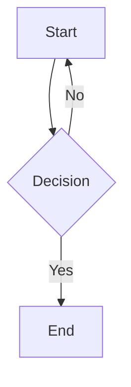

# MarkView.Avalonia.Mermaid

[](https://www.nuget.org/packages/MarkView.Avalonia.Mermaid)
[](https://www.nuget.org/packages/MarkView.Avalonia.Mermaid)
[](https://avaloniaui.net)
[](https://github.com/Kryptos-FR/MarkView.Avalonia/actions/workflows/ci.yml)
[](../../LICENSE.md)

Mermaid diagram rendering extension for [MarkView.Avalonia](https://www.nuget.org/packages/MarkView.Avalonia). Renders fenced `mermaid` code blocks as vector diagrams using [Mermaider](https://github.com/nullean/mermaider) — a pure managed .NET parser and renderer. No browser, no WebView, and no JavaScript runtime required.

## Installation

```bash
dotnet add package MarkView.Avalonia.Mermaid
```

## Quick Start

Call `UseMermaid()` before setting `Markdown`:

```csharp
var viewer = new MarkdownViewer();
viewer.UseMermaid();
viewer.Markdown = markdownText;
```

Diagrams are written in standard [Mermaid](https://mermaid.js.org) syntax inside a fenced code block:

````markdown

````

## Supported Diagram Types

The extension targets the diagram types supported by the referenced Mermaider version, including common diagrams such as:

- Flowcharts (`graph TD`, `flowchart LR`)
- Sequence diagrams (`sequenceDiagram`)
- Class diagrams (`classDiagram`)
- State diagrams (`stateDiagram-v2`)
- Entity-relationship diagrams (`erDiagram`)
- Gantt charts (`gantt`)
- Pie charts (`pie`)
- Git graphs (`gitGraph`)
- Mind maps (`mindmap`)
- Timeline (`timeline`)

See the [Mermaid documentation](https://mermaid.js.org/intro/) for syntax reference. If a diagram fails to render, the extension falls back to a plain-text block containing the original source.

## Theme Awareness

Diagrams are rendered with colours matching the active Avalonia theme variant:

| Variant | Background | Foreground | Accent |
|---------|-----------|-----------|--------|
| Dark | `#18181B` | `#FAFAFA` | `#60a5fa` |
| Light | `#FFFFFF` | `#27272A` | `#3b82f6` |

When the user switches between light and dark, the diagram is automatically re-rendered. The `Border` container stays in place — scroll position is preserved and other document elements are not affected.

## Combining with Syntax Highlighting

When `MarkView.Avalonia.SyntaxHighlighting` is also registered, non-mermaid fenced code blocks in the same document get full syntax highlighting. Registration order does not matter:

```csharp
viewer
    .UseTextMateHighlighting()
    .UseMermaid();
```

`MermaidBlockRenderer` handles all `FencedCodeBlock` nodes. Mermaid blocks are rendered as diagrams; all other fenced blocks are rendered as styled code blocks using any `ICodeHighlighter` registered by the SyntaxHighlighting extension.

## Platform Notes

Mermaider renders diagrams in managed .NET code (no JavaScript runtime). If diagram rendering fails for any reason, this extension automatically falls back to a plain-text `Border` containing the original Mermaid source.

## How It Works

`UseMermaid()` registers a `MermaidExtension` which inserts `MermaidBlockRenderer` at index 0 of `renderer.ObjectRenderers`. Being first in the renderer list, it intercepts every `FencedCodeBlock` before the default `CodeBlockRenderer`.

For mermaid blocks:
1. Source lines are extracted from the fenced block.
2. `MermaidRenderer.RenderSvg` produces an SVG string with Mermaider's CSS custom properties.
3. CSS variable references (`var(--_text)` etc.) are inlined with computed hex values so SkiaSharp can render the diagram.
4. The SVG is loaded into an `SvgImage` and displayed in an `Image` control.
5. `MaxWidth` is constrained to the `ScrollViewer` viewport and updated on resize.

For non-mermaid blocks, rendering is delegated to the standard code block path (with theme-aware in-place `TextBlock.Inlines` rebuild if a `IThemeAwareCodeHighlighter` is registered).

## License

[MIT](../../LICENSE.md) © Nicolas Musset
